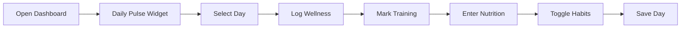

# Client App Reference Guide

This document serves as the complete reference for building iOS/Android mobile apps that replicate the client-facing web application functionality. It documents all features, API endpoints, data models, and business logic needed for mobile development.

---

## Table of Contents

1. [Overview](#overview)
2. [Core Features](#core-features)
3. [Authentication & Authorization](#authentication--authorization)
4. [API Endpoints](#api-endpoints)
5. [Data Models](#data-models)
6. [User Flows](#user-flows)
7. [Business Logic](#business-logic)
8. [UI/UX Patterns](#uiux-patterns)
9. [State Management](#state-management)
10. [Coach-Client Interactions](#coach-client-interactions)
11. [File Structure Reference](#file-structure-reference)

---

## Overview

The client app is a fitness coaching platform where clients can:
- Track daily wellness, nutrition, and training (Daily Pulse)
- View and complete assigned training plans
- Monitor nutrition targets and macro intake
- Submit weekly check-ins with progress photos
- Track progress over time with analytics
- Manage daily habits
- Access educational resources

### Technology Stack (Web)
- **Frontend**: Next.js 14 (App Router), React, TypeScript
- **Backend**: Supabase (PostgreSQL + Auth)
- **Styling**: Tailwind CSS, shadcn/ui components
- **State**: React hooks, Context API for auth

---

## Core Features

### 1. Day View (daily tracking)
**Primary Feature** — home route `/client` (there is no `/client/dashboard`)

The Daily Pulse is the centerpiece of the client experience, allowing daily logging of:
- **Wellness Metrics**: Mood (1-5 emoji scale), Energy (1-10), Sleep (1-10), Stress (1-10), Soreness (1-10, higher = more sore), Notes
- **Training Completion**: Mark planned sessions complete, log alternative sessions, add unplanned activities
- **Nutrition Tracking**: Log calories and macros (protein, carbs, fat) with dynamic targets
- **Habit Tracking**: Toggle daily habits on/off with auto-save

**Key Components**:
- `components/client-portal/day/` - Day view cards
- `components/client-portal/training/set-tracker.tsx` - Workout tracker

There is **no combined day save**: wellness, nutrition, habits and training each write to their own endpoint and revalidate the shared `day-summary` SWR key.
- See `docs/CLIENT-PORTAL-REDESIGN.md` for the portal's architecture

### 2. Training Plans & Workout Logging
**Locations**: `/client/program/training` (full plan), `/client` day view (today's events), `/client/training` (tracker)

- View the active program as ordered day-slots grouped by `weekIndex` — rest days appear as real "Rest" entries
- See per-set prescription (`setSpecs`: set type, reps, load, RPE, tempo, rest) plus an optional demo `videoUrl`
- Log a prescribed day by tapping its event; log a rest-day workout via `session-logs`
- Per-exercise history and PRs via `exercise-history`
- The plan is a **positional multi-week program** — render by `weekIndex` + `orderIndex`, not by weekday

### 3. Nutrition Plans & Macro Tracking
**Location**: `/client/nutrition`

- View daily calorie and macro targets
- Targets adjust based on training (training day vs rest day)
- Visual macro breakdown
- Integration with Daily Pulse for logging

### 4. Progress Tracking
**Location**: `/client/progress`

- Upload progress photos (front, side, back views)
- Log body measurements (weight, body fat %, circumferences)
- View historical charts and trends
- Analytics for weight, measurements, and training consistency

### 5. Weekly Check-ins
**Locations**: 
- `/client/check-in` - Authenticated form

- Comprehensive weekly progress submission
- Includes subjective metrics, training adherence, photos
- AI-powered summary generation for coaches
- Authenticated only. The public token ("magic link") form was removed in
  migration 142 — there is no unauthenticated check-in path.

### 6. Habits Management
**Integrated in Daily Pulse**

- Daily habit tracking with boolean toggles
- Auto-saves independently from other Daily Pulse data
- Historical tracking with date filtering
- Streak counting and analytics

### 7. Push Notifications
**Location**: In-app dropdown (`components/client/notifications-dropdown.tsx`)

- Check-in reminders
- Program updates
- Coach messages
- System notifications

### 8. Resources & Educational Content
**Location**: `/client/resources`

- Access to educational materials
- Training guides
- Nutrition information

---

## Authentication & Authorization

### User Roles
```typescript
type UserRole = "client" | "trainer"
```

### Auth Context
**Location**: `contexts/auth-context.tsx`

```typescript
interface AuthContextType {
  user: User | null
  profile: Profile | null
  role: UserRole | null
  isClient: boolean
  isTrainer: boolean
  login: (email: string, password: string) => Promise<UserRole | null>
  logout: () => Promise<void>
  // ... other methods
}
```

### Middleware Protection
**Location**: `middleware.ts`

- Routes starting with `/client/*` require `role === "client"`
- Automatic redirection based on role:
  - Clients → `/client`
  - Trainers → `/dashboard`
- Public routes: `/invite/[token]`

---

## API Endpoints

All client API endpoints require authentication except where noted.

### Authentication
- Login/logout are **Supabase client SDK calls, not app routes.** See `contexts/auth-context.tsx`; session cookies are refreshed in `middleware.ts`.
- `GET /api/client/me` - Get current user profile

### Daily Logs (per-date, split by domain)

> Reads are one call; writes are per-domain. There is no combined daily-log write.

- `GET /api/client/day-summary?date={YYYY-MM-DD}` - The day read (`DaySummary`, `types/client-day.ts`)
- `GET` + `PATCH /api/client/daily-logs/{date}/wellness` - Mood / energy / sleep / stress / soreness
- `GET` + `PATCH /api/client/daily-logs/{date}/nutrition` - Calories + macros for that date
- Training is **not** part of a daily log — see the Training section
- Habits are **not** part of a daily log — see the Habits section

### Training

> **Events-as-SOT.** Prescription lives in `training_events` (one row per calendar date); completion lives in `session_logs`, keyed by `training_event_id`.

- `GET /api/client/training-plan` - The active plan, self-describing (`ClientTrainingPlan | null`)
- `GET /api/client/day-summary?date={YYYY-MM-DD}` - The one read the day view needs: `training: TrainingEventSummary[]`, `trainedFor`, nutrition, wellness, habits. **A rest day returns `training: []`** — rest slots are real DB rows but emit no event
- `GET /api/client/training/events/{eventId}` - Event detail: `{ event, session, exercises, sessionLog, exerciseLogs }`
- `POST /api/client/training/events/{eventId}/log` - Log a prescribed event. `201 {sessionLogId}` · `403` day locked · `404` not found / not this client
- `POST /api/client/training/session-logs` - Event-less log: the client trained on a date with no prescribed event (rest-day training). One log per date — a second submission for the same date EDITS the existing log
- `GET /api/client/training/sessions/{sessionId}` - Session + exercises; 404 unless the session belongs to the client's ACTIVE plan. Powers the rest-day picker
- `GET /api/client/training/exercise-history?metric=list|progression|prs` - `progression`/`prs` also take `exerciseId` or `exerciseName`. **Warm-up sets are excluded from every metric**

### Nutrition
- `GET /api/client/nutrition` (alias: `GET /api/client/nutrition-plan`) - Get nutrition targets (`getClientNutritionTargets`)
  ```json
  {
    "planId": "…",
    "calorieTarget": 2200,
    "proteinTargetG": 180,
    "carbTargetG": 230,
    "fatTargetG": 70,
    "baselineCalories": 2200,
    "dietType": "balanced",
    "includeActivityBurn": true,
    "customMacrosEnabled": false,
    "dailyTargets": [
      {
        "day": "monday",
        "dayLabel": "Monday",
        "isTrainingDay": true,
        "calories": 2530,
        "baselineCalories": 2200,
        "proteinG": 180,
        "carbsG": 280,
        "fatG": 78,
        "proteinPercent": 28,
        "carbsPercent": 44,
        "fatPercent": 28,
        "trainingSessions": [{ "name": "Push", "calories": 330 }],
        "calorieSurplusPercentage": 15,
        "note": "Higher carbs — heavy session"
      }
      // … 7 entries, one per weekday of the CURRENT client-local week
    ]
  }
  ```

  > **RN contract — `dailyTargets` is a per-date window, not a 2-slot template (events-as-SOT, shipped Sessions 4-5).** The legacy `trainingDayCalories` / `restDayCalories` 2-slot shape is **gone**. `dailyTargets` is a **7-entry array, one per weekday of the current client-local week**, built from that week's actual `nutrition_events` — so a coach's per-day edit (`is_modified`) and per-day `note` show through, and the macro split honors `clients.surplus_as_carbs`. RN may still index by weekday, but **treat the values as date-specific to the current week**, not a generic weekly template. A coach edit to a **future** week surfaces on the per-date day-view (`GET /api/client/daily-logs/{date}/nutrition`), not this card, until that week becomes current. Logged past days read their frozen `nutrition_logs` snapshot (no `note`), never the event. Full field list: `DailyNutritionTargets` (`utils/nutrition-helpers.ts`).

### Progress
- `GET /api/client/progress?days={30|60|90}` - Get progress data
- Returns weight history, measurements, training consistency

### Check-ins
- `GET /api/client/check-ins?limit=20&offset=0` - Get check-in history
- `POST /api/client/check-ins` - Submit new check-in
- `GET /api/client/check-ins/{id}` - Get specific check-in
- `GET /api/client/check-in-context` - Get context for check-in form

### Notifications
- `GET /api/client/notifications` - Get notifications
- `/api/client/notifications` is **GET-only**: `read` is computed server-side and is not client-mutable.

### Habits
- `GET /api/client/habits` - Get active habits
- `POST /api/client/habits/log` - Log a habit (the habit id travels in the **body**, not the path)
- `GET /api/client/habits/logs` · `GET /api/client/habits/logs/today` - Habit log history / today's state

---

## Data Models

### DailyLog
```typescript
type DailyLog = {
  id: string
  clientId: string
  date: string // YYYY-MM-DD
  
  // Wellness
  mood?: number // 1-5
  energy?: number // 1-10
  sleep?: number // 1-10
  stress?: number // 1-10
  soreness?: number // 1-10 (higher = more sore)
  notes?: string
  
  // Training
  trained?: boolean
  trainingSessionId?: string
  trainingData?: {
    sessionCompleted: boolean
    trainingSessionId: string | null
    trainingSessionName: string | null
    isAlternativeSession: boolean
    activityStatuses: Record<string, {
      completed: boolean
      activityName: string
      estimatedCalories: number
    }>
    unplannedActivities: Array<{
      activityName: string
      intensityLevel: "low" | "moderate" | "vigorous"
      durationMinutes: number
    }>
  }
  
  // Nutrition
  caloriesConsumed?: number
  proteinG?: number
  carbsG?: number
  fatG?: number
  targetCalories?: number
  targetProteinG?: number
  targetCarbsG?: number
  targetFatG?: number
}
```

### TrainingPlan
Source of truth: `types/client-training-plan.ts`. This is the **client read shape** returned by `GET /api/client/training-plan` — it is not the coach-side `types/training.ts` `TrainingPlan`.

```typescript
type ClientTrainingPlan = {
  planId: string
  planName: string
  sessions: ClientTrainingSessionEntry[] // ordered by (weekIndex, orderIndex); rest days are real isRest entries
}

type ClientTrainingSessionEntry = {
  id: string
  name: string           // "Rest" on rest entries
  focus: string | null
  orderIndex: number
  weekIndex?: number     // 0-based; group under "Week N" dividers
  isRest: boolean        // rest days are REAL entries, not gaps
  estimatedDurationMinutes: number | null
  exercises: ClientTrainingExercise[] // [] when isRest
}

type ClientTrainingExercise = {
  id: string
  name: string
  orderIndex: number
  sets: number            // PROJECTION of setSpecs — never independent truth
  repsMin: number | null  // PROJECTION
  repsMax: number | null  // PROJECTION
  repsTarget: string | null
  rpeTarget: number | null
  tempo: string | null
  restSeconds: number | null
  isWarmup: boolean       // legacy; always false on builder-authored content
  supersetGroup: string | null // legacy; always null on new content
  setSpecs: SetSpec[] | null   // AUTHORITATIVE per-set prescription when non-null
  videoUrl: string | null      // optional demo video
}
```

> **RN contract — days are POSITIONAL, not weekdays.** `dayOfWeek` is gone: placement writes `day_of_week: null` and tiles the whole authored program as a sequential date-walk. Render by `weekIndex` + `orderIndex`, never by weekday name.

> **RN contract — `setSpecs` wins over `sets`/`repsMin`/`repsMax`.** The compact trio is a maintained projection (non-warmup set count; reps span the working sets). A renderer reading only the trio is truthful but lossy — it loses warm-ups, AMRAP/drop/failure sets, per-set loads and per-set rest. Seed the log form from `setSpecs` when present; otherwise synthesize N `working` specs from the trio.

> **RN contract — every entry is a training day or a rest day.** There is no session-type axis.

### SetSpec (per-set prescription)

```typescript
type SetType = "warmup" | "working" | "amrap" | "drop" | "failure"

type SetSpec = {
  set_number: number
  set_type: SetType
  reps_min?: number | null
  reps_max?: number | null
  reps_target?: string | null
  load_type?: "absolute" | "pct_1rm" | "pct_top" | null
  load_value?: number | null
  rpe_target?: number | null
  tempo?: string | null
  rest_seconds?: number | null
  drops?: unknown[]
}
```

Invariants RN must respect:
- Max 30 specs per exercise; at least one non-warmup spec is always present.
- `setSpecs === null` means "not authored per-set" — synthesize from the compact trio rather than showing nothing.
- **Warm-up sets are excluded from every performance metric and from compliance.** Show them in the tracker; exclude them from PR/volume/e1RM display.

### Training log payload (`POST /api/client/training/events/{eventId}/log`)

```typescript
type LogTrainingEventInput = {
  completionQuality: "full" | "partial" | "skipped"
  notes?: string              // <= 1000
  performedSessionId?: string // only when the client swapped sessions
  exercises?: Array<{
    trainingExerciseId?: string
    exerciseId?: string
    exerciseName: string
    sets: Array<{ setNumber, reps?, weight?, rpe?, setType? }>
    weightUnit: "lbs" | "kg"
    notes?: string
    skipped?: boolean         // sets may be empty only when skipped === true
  }>
}
```

> **RN contract — `setType` is coach-prescribed, never client-chosen.** The schema accepts a `setType` per set and the server **ignores it**: `set_logs.set_type` is seeded from the prescription snapshot. Do not build a set-type picker.

> **RN contract — every save FULLY REPLACES the log's exercises.** The writer deletes all `exercise_logs` for the log (set_logs cascade) and re-inserts. Send the complete list, never a delta.

### CheckIn
```typescript
type CheckIn = {
  id: string
  clientId: string
  
  // Subjective Metrics
  mood?: number
  energy?: number
  sleep?: number
  stress?: number
  soreness?: number
  
  // Body Metrics
  weight?: number
  bodyFatPercentage?: number
  measurements?: {
    waist?: number
    hips?: number
    chest?: number
    arms?: number
    thighs?: number
  }
  
  // Training Data
  sessionCompletions?: Array<{
    trainingSessionId: string
    sessionName: string
    completed: boolean
    completionQuality?: "full" | "partial" | "skipped"
  }>
  
  // Photos
  photoFront?: string // URL
  photoSide?: string // URL
  photoBack?: string // URL
  
  // AI Summary
  aiSummary?: string
  status: "pending" | "ai_processed" | "reviewed"
}
```

### Habit
```typescript
type Habit = {
  id: string
  clientId: string
  name: string
  type: "boolean" | "numeric"
  targetValue?: number
  unit?: string
  isActive: boolean
  createdAt: string
}

type HabitLog = {
  id: string
  habitId: string
  date: string // YYYY-MM-DD
  completed: boolean // Always boolean, even for numeric habits
  value?: number // Actual value for numeric habits
}
```

---

## User Flows

### 1. Daily Logging Flow


**Key Points**:
- Single save for wellness + training + nutrition (except habits)
- Habits auto-save independently
- Can navigate between days without losing unsaved changes
- Logged days show summary view with edit option

### 2. Check-in Submission Flow

**Authenticated Flow**:
1. Navigate to `/client/check-in`
2. Fill multi-step form
3. Upload progress photos
4. Submit → AI generates summary

### 3. Training Session Completion
1. View today's planned session in Daily Pulse
2. Toggle "Session Complete" 
3. Or select alternative session from dropdown
4. Add any unplanned activities
5. System calculates total calories burned
6. Nutrition targets auto-adjust

---

## Business Logic

### Nutrition Target Calculations

**Base Formula**:
```typescript
// Daily targets adjust based on activity
adjustedCalories = baselineCalories + trainingCalories + activityCalories

// Protein is ALWAYS held. Carbs/fat split by DIET TYPE, not a fixed 60/40:
//   balanced 50/50 · high_carb 65/35 · low_carb 25/75 · keto 10/90 · custom 50/50
//
// Training-day surplus (applySurplusSplit — the single source of truth):
//   surplusAsCarbs === false -> carbs + fat scale to the higher total,
//     PRESERVING their stored ratio (a keto client stays keto)
//   surplusAsCarbs === true  -> fat is held too; carbs absorb the whole surplus
//
// Do NOT re-derive client-side: the API already returns final grams per date.
```

**Training Day Adjustments**:
- Training sessions have estimated calories (AI-calculated)
- External activities use MET values
- Unplanned activities NOT included in target (only completed activities)

### Adherence Calculations

**Nutrition Adherence**:
- "hit" = within **50 kcal** of target (`NUTRITION_ADHERENCE_HIT_THRESHOLD`)
- "partial" = within **200 kcal** (`NUTRITION_ADHERENCE_PARTIAL_THRESHOLD`)
- "missed" = beyond 200 kcal, or not logged

These are **absolute calorie deltas from `lib/constants.ts`, not percentages.**

**Training Adherence**:
- Based on sessions completed / sessions planned
- Calculated weekly for check-ins

### Habit Streaks
```typescript
// Streak counts consecutive days completed
// Resets to 0 on miss
// Only counts habits that existed on that date
habits.filter(h => new Date(h.createdAt) <= selectedDate)
```

### Progress Photo Requirements
- Max file size: 5MB
- Accepted formats: JPEG, PNG, WebP
- Auto-compressed on upload
- Stored in Supabase Storage

---

## UI/UX Patterns

### Navigation Structure

**Mobile (< 640px)**:
- Bottom tab navigation
- 5 main sections: Home, Training, Nutrition, Progress, Resources
- Fixed position at bottom

**Desktop**:
- Left sidebar navigation
- Same 5 sections
- User profile and logout in header

### Color Schemes

**Wellness Metrics**:
- Mood: Emoji-based (😔 😕 😐 🙂 😊)
- Energy: Green gradient (low=red, med=yellow, high=green)
- Sleep: Blue gradient
- Stress: Red gradient (inverted - low is good)
- Soreness: Purple gradient (inverted - low is good)

**Adherence Indicators**:
- Green (#10b981): On track / Complete
- Amber (#f59e0b): Partial / Warning
- Red (#ef4444): Missed / Alert
- Gray (#6b7280): No data

### Component Patterns

**Cards**: Primary container for all content sections
```typescript
<Card>
  <CardHeader>
    <CardTitle>Section Title</CardTitle>
  </CardHeader>
  <CardContent>
    {/* Content */}
  </CardContent>
</Card>
```

**Loading States**: Skeleton components for all data fetches
```typescript
<Skeleton className="h-32 w-full" />
```

**Forms**: Controlled inputs with real-time validation
```typescript
<Input
  value={value}
  onChange={(e) => setValue(e.target.value)}
  placeholder="Enter value"
/>
```

### Responsive Design

**Breakpoints**:
- Mobile: < 640px
- Tablet: 640px - 1024px  
- Desktop: > 1024px

**Key Differences**:
- Mobile: Bottom navigation, stacked layouts
- Desktop: Sidebar navigation, grid layouts
- Touch targets: Min 44x44px on mobile

---

## State Management

### Client-Side State

**Authentication State**: Global via Context API
- User profile
- Role (client/trainer)
- Session status

**Daily Pulse State**: Local to component
```typescript
// All state owned by daily-pulse.tsx
const [selectedDate, setSelectedDate] = useState()
const [dayLog, setDayLog] = useState()
const [isLoading, setIsLoading] = useState()
const [isSaving, setIsSaving] = useState()
```

**Form State**: Controlled components
- All forms use controlled inputs
- Validation on submit
- Error states per field

### Data Fetching

**Cache Strategy**:
```typescript
// No caching for real-time data
fetch(url, { cache: 'no-store' })

// Response headers
'Cache-Control': 'no-store, max-age=0'
```

**Loading Patterns**:
1. Show skeleton/spinner
2. Fetch data
3. Handle errors with user feedback
4. Display data or empty state

### Offline Considerations (Mobile)

**Required Offline Features**:
- View cached training plan
- Log daily data (sync later)
- View previous check-ins
- Access resources

**Sync Strategy**:
- Queue actions when offline
- Sync on connection restore
- Conflict resolution (server wins)

---

## Coach-Client Interactions

### What Coaches Control
- Assign/update training plans
- Set nutrition targets
- Review check-ins and provide feedback
- Create/modify habits for client
- Send notifications

### Data Coaches See
- Aggregated Daily Pulse data (28-day view)
- All check-in submissions with photos
- Training completion rates
- Nutrition adherence patterns
- Wellness trends and alerts

### Automated Alerts
Coaches receive alerts when:
- Mood ≤ 2 for 3+ consecutive days
- Energy ≤ 3 for 3+ consecutive days  
- Stress ≥ 8 for 3+ consecutive days
- Soreness ≥ 8 for 3+ consecutive days
- Sleep ≤ 4 for 3+ consecutive days
- Multiple metrics in warning zones

---

## File Structure Reference

### Client-Facing Routes
```
/app/
└── client/                    # All authenticated client pages
    ├── dashboard/page.tsx     # Main dashboard with Daily Pulse
    ├── training/page.tsx      # Training plans view
    ├── nutrition/page.tsx     # Nutrition targets
    ├── progress/page.tsx      # Progress tracking
    ├── check-in/page.tsx      # Weekly check-in form
    ├── resources/page.tsx     # Educational content
    └── layout.tsx             # Client portal layout wrapper
```

### Client Components
```
/components/
├── daily-pulse/              # Daily Pulse feature (20 files)
│   ├── daily-pulse.tsx       # Main container
│   ├── wellness-section.tsx  # Mood, energy, sleep, stress
│   ├── training-section.tsx  # Training completion
│   ├── nutrition-section.tsx # Calorie/macro tracking
│   ├── habits-section.tsx    # Daily habits
│   └── utils/               # Helper functions
├── client/                   # Client-specific components
│   ├── notifications-dropdown.tsx
│   └── progress/            # Progress tracking components
└── client-portal/           # Shared portal components
    ├── client-navigation.tsx # Mobile/desktop nav
    ├── training/            # Training components
    └── nutrition/           # Nutrition components
```

### API Routes
```
/app/api/client/
├── daily-logs/route.ts      # Daily Pulse data
├── training/route.ts        # Training plans
├── nutrition/route.ts       # Nutrition targets
├── progress/route.ts        # Progress data
├── check-ins/route.ts       # Check-in submissions
├── notifications/route.ts   # In-app notifications
├── habits/route.ts          # Habit management
└── me/route.ts             # User profile
```

### Types & Services
```
/types/
├── auth.ts                 # User, Profile, Role types
├── training.ts             # TrainingPlan, Session, Exercise
├── check-in.ts             # CheckIn, metrics types
├── daily-log.ts            # DailyLog, training data
└── habit.ts               # Habit, HabitLog types

/services/
├── client-portal-service.ts # Client data fetching
├── daily-logs-service.ts    # Daily Pulse operations
├── check-in-service.ts      # Check-in handling
└── supabase-client.ts      # Database client
```

---

## Mobile App Development Guidelines

### Recommended Architecture

**Native Apps**:
- iOS: Swift/SwiftUI
- Android: Kotlin/Jetpack Compose
- Shared business logic via Kotlin Multiplatform (optional)

**Cross-Platform**:
- React Native (reuse React knowledge)
- Flutter (if starting fresh)

### Key Native Features to Add

1. **Biometric Authentication**: FaceID/TouchID/Fingerprint
2. **Push Notifications**: Check-in reminders, coach messages
3. **Camera Integration**: Progress photos with guides
4. **Health Kit/Google Fit**: Import weight, sleep data
5. **Offline Mode**: Cache critical data, sync when online
6. **Widgets**: Daily Pulse quick entry, today's workout

### API Integration

- Use existing REST endpoints unchanged
- Add mobile-specific headers for analytics
- Implement token refresh for long sessions
- Cache responses appropriately

### Platform-Specific Considerations

**iOS**:
- App Store requires privacy policy
- Health data requires special permissions
- Background fetch for notifications

**Android**:
- Material Design 3 guidelines
- Handle various screen sizes
- Battery optimization exemption for sync

---

## Version History

- **v1.0** (March 2024): Initial documentation
- Created for mobile app development reference
- Based on web app sessions 1-19

---

## Related Documentation

- `docs/ARCHITECTURE.md` (Coach Library + Training prescription sections) - The program builder, `set_specs` / `weekIndex` / `isRest` model (the builder execution plan was deleted after shipping)
- [CONVENTIONS.md](./CONVENTIONS.md) - Code style and conventions
- API documentation in individual route files

---

*This document should be updated whenever significant changes are made to the client-facing features or APIs.*