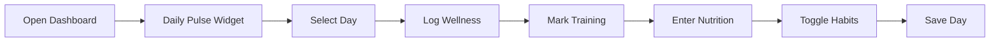

# Client App Reference Guide

This document serves as the complete reference for building iOS/Android mobile apps that replicate the client-facing web application functionality. It documents all features, API endpoints, data models, and business logic needed for mobile development.

---

## Table of Contents

1. [Overview](#overview)
2. [Core Features](#core-features)
3. [Authentication & Authorization](#authentication--authorization)
4. [API Endpoints](#api-endpoints)
5. [Data Models](#data-models)
6. [User Flows](#user-flows)
7. [Business Logic](#business-logic)
8. [UI/UX Patterns](#uiux-patterns)
9. [State Management](#state-management)
10. [Coach-Client Interactions](#coach-client-interactions)
11. [File Structure Reference](#file-structure-reference)

---

## Overview

The client app is a fitness coaching platform where clients can:
- Track daily wellness, nutrition, and training (Daily Pulse)
- View and complete assigned training plans
- Monitor nutrition targets and macro intake
- Submit weekly check-ins with progress photos
- Track progress over time with analytics
- Manage daily habits
- Access educational resources

### Technology Stack (Web)
- **Frontend**: Next.js 14 (App Router), React, TypeScript
- **Backend**: Supabase (PostgreSQL + Auth)
- **Styling**: Tailwind CSS, shadcn/ui components
- **State**: React hooks, Context API for auth

---

## Core Features

### 1. Day View (daily tracking)
**Primary Feature** — home route `/client` (there is no `/client/dashboard`)

The Daily Pulse is the centerpiece of the client experience, allowing daily logging of:
- **Wellness Metrics**: Mood (1-5 emoji scale), Energy (1-10), Sleep (1-10), Stress (1-10), Soreness (1-10, higher = more sore), Notes
- **Training Completion**: Mark planned sessions complete; on a rest day pick a session from this week (it moves to that day); on a prescribed day swap with another day's session; add unplanned exercises
- **Nutrition Tracking**: Log calories and macros (protein, carbs, fat) with dynamic targets
- **Habit Tracking**: Toggle daily habits on/off with auto-save

**Key Components**:
- `components/client-portal/day/` - Day view cards
- `components/client-portal/training/set-tracker.tsx` - Workout tracker

There is **no combined day save**: wellness, nutrition, habits and training each write to their own endpoint and revalidate the shared `day-summary` SWR key.
- See `docs/CLIENT-PORTAL-REDESIGN.md` for the portal's architecture

### 2. Training Plans & Workout Logging
**Locations**: `/client/program/training` (full plan), `/client/program` (this week's layout, tap-to-move), `/client` day view (today's events), `/client/training` (tracker)

- View the active program as ordered day-slots grouped by `weekIndex` — rest days appear as real "Rest" entries
- See per-set prescription (`setSpecs`: set type; reps, load, RPE, RIR, distance, duration, pace, split, calories, cadence, stroke rate, resistance, HR zone, target HR, power and % FTP each as a min/max pair; tempo as one compound value; rest) plus an optional demo `videoUrl` — and each exercise's `prescribedFields`, the columns to render
- Log a prescribed day by tapping its event; on a rest day, pick a session from this week — it moves to that day (`events/layout`) and opens as an ordinary event; rearrange the whole week from the Program tab — a client-composed `events/layout` list
- Per-exercise history and PRs, and every exercise's bests in one table, via `exercise-history`
- The plan is a **positional multi-week program** — render by `weekIndex` + `orderIndex`, not by weekday

### 3. Nutrition Plans & Macro Tracking
**Location**: `/client/nutrition`

- View daily calorie and macro targets
- Targets adjust based on training (training day vs rest day; a day holding several sessions adds every session's surplus) — including after the client moves a session: the day's target follows the session (a day's target is computed from the session on it, so the next read re-prices it), and a day the client has already logged shows the refreshed target at once — the log stores what they ate, never a target. **Onboarding copy owed (RN):** tell the client that swapping a training day changes that day's calorie target.
- Visual macro breakdown
- Integration with Daily Pulse for logging

### 4. Progress Tracking
**Location**: `/client/metrics` (the Metrics hub; `/client/progress` is a redirect stub kept so old links resolve)

- Upload progress photos (front, side, back views)
- Log body measurements (weight, body fat %, circumferences)
- View historical charts and trends
- Analytics for weight, measurements, and training consistency

### 5. Weekly Check-ins
**Locations**: 
- `/client/check-in` - Authenticated form

- Comprehensive weekly progress submission
- Includes subjective metrics, training adherence, photos
- AI-powered summary generation for coaches
- Authenticated only. The public token ("magic link") form was removed in
  migration 142 — there is no unauthenticated check-in path.

### 6. Habits Management
**Integrated in Daily Pulse**

- Daily habit tracking with boolean toggles
- Auto-saves independently from other Daily Pulse data
- Historical tracking with date filtering
- Streak counting and analytics

### 7. Push Notifications
**Location**: In-app dropdown (`components/client/notifications-dropdown.tsx`)

- Check-in reminders
- Program updates
- Coach messages
- System notifications

### 8. Resources & Educational Content
**Location**: `/client/resources`

- Access to educational materials
- Training guides
- Nutrition information

---

## Authentication & Authorization

### User Roles
```typescript
type UserRole = "client" | "trainer"
```

### Auth Context
**Location**: `contexts/auth-context.tsx`

```typescript
interface AuthContextType {
  user: User | null
  profile: Profile | null
  role: UserRole | null
  isClient: boolean
  isTrainer: boolean
  login: (email: string, password: string) => Promise<UserRole | null>
  logout: () => Promise<void>
  // ... other methods
}
```

### Middleware Protection
**Location**: `middleware.ts`

- Routes starting with `/client/*` require `role === "client"`
- Automatic redirection based on role:
  - Clients → `/client`
  - Trainers → `/dashboard`
- Public routes: `/invite/[token]`

---

## API Endpoints

All client API endpoints require authentication except where noted.

### Authentication
- Login/logout are **Supabase client SDK calls, not app routes.** See `contexts/auth-context.tsx`; session cookies are refreshed in `middleware.ts`.
- `GET /api/client/me` - Get current user profile. Carries `logsOpenFrom` (YYYY-MM-DD, or `null`): the first day this client may log. A day is loggable when it is on or after it and not after the client's today. It is the start of the week their current check-in covers, moving forward when they send a check-in or when the next check-in day arrives. Refetch it after a check-in submit.

### Daily Logs (per-date, split by domain)

> Reads are one call; writes are per-domain. There is no combined daily-log write.

- `GET /api/client/day-summary?date={YYYY-MM-DD}` - The day read (`DaySummary`, `types/client-day.ts`). Each `training[]` entry is a session on THIS day — done here, to be done here, or missed here. A workout has one date (the event's) because the client moves the event to the day they train, so there is no "done on another day" state: the `loggedOn` and `trainedFor` fields that carried it were retired 2026-08-26 (before any RN consumer existed).
- `GET` + `PATCH /api/client/daily-logs/{date}/wellness` - Mood / energy / sleep / stress / soreness
- `GET` + `PATCH /api/client/daily-logs/{date}/nutrition` - Calories + macros for that date
- Training is **not** part of a daily log — see the Training section
- Habits are **not** part of a daily log — see the Habits section

### Training

> **Events-as-SOT.** Prescription lives in `training_events` (one row per session per calendar date); completion lives in `session_logs`, keyed by `training_event_id`.

> **RN contract — a day can hold several sessions.** A day holds its sessions in order, each its own workout (a morning run and an evening lift): each is opened, logged and counted on its own, and every read below lists a day's sessions in the day's order — render them in the order given. Nothing refuses a day for holding a session: a session moved onto a day that holds some joins it, after them. A day's nutrition target adds every session's training surplus.

- `GET /api/client/training-plan` - The active plan, self-describing (`ClientTrainingPlan | null`)
- `GET /api/client/day-summary?date={YYYY-MM-DD}` - The one read the day view needs: `training: TrainingEventSummary[]`, nutrition, wellness, habits. `training` lists every session on the day, in the day's order. **`nutrition` is always present** — `hasLog`, `caloriesConsumed`, `targetCalories` (null when no nutrition plan covers the day) and the coach's `note` — because a day with no target still takes a log: only the future and a closed week refuse one. **A rest day returns `training: []`** — rest slots are real DB rows but emit no event
- `GET /api/client/training/events/{eventId}` - Event detail: `{ event, session, groups, sessionLog, exerciseLogs, groupScores }` (`TrainingEventDetail`, below). `groupScores` is the log's timed-group scores, one per scored group (see "RN contract — timed groups"). `session` is the session's header — live, its name, focus and duration with no groups of its own; or the log's `prescribed_session_snapshot` once the session is gone. `groups` is the workout in order, each group with its settings and its exercises in order, each exercise live or read off its log's snapshot: the live session's groups first, then any logged exercise the live session no longer holds (all of them when the session is gone), in the group its snapshot records — a snapshot logged before groups existed reads as a straight-sets group of one whose `id` is the exercise's own. Each `exerciseLogs[].prescribedExerciseSnapshot` records the prescription as logged, including `order_index` (its place in its group) and `group` (`id`, `order_index`, `format` and every setting in snake_case). Render it group by group — see "RN contract — how a group reads" and "RN contract — logging a group"
- `POST /api/client/training/events/{eventId}/log` - Log a prescribed event. `201 {sessionLogId}` · `400` the save records nothing, body `"Tick at least one set to log this workout."` (see "RN contract — a save records something"), or a group score its group cannot take, body its sentence (see "RN contract — timed groups") · `403` day locked, body `"This day is locked."` (outside `logsOpenFrom`…today) · `404` not found / not this client, a score naming a group outside the performed session included
- `DELETE /api/client/training/events/{eventId}/log` - **Clear log**: "I did not do this after all". Deletes the workout's log and everything under it — its exercise logs and their sets — and puts the workout back to `scheduled` with nothing recorded, in one transaction. `200 { cleared: boolean }` — `false` when the workout carried no log, which is **not** an error · `403` day locked, body `"This day is locked."` — allowed exactly where a log write is · `404` not found / not this client. Refresh the day after it: the workout is loggable again
- `GET /api/client/training/sessions/{sessionId}` - Session + its groups of exercises; 404 unless the session belongs to the client's ACTIVE plan. Powers the rest-day picker
- `GET /api/client/training/week?date={YYYY-MM-DD}` - The training week containing `date` (`ClientTrainingWeek`, `types/client-training-week.ts`): `{ weekStart, weekEnd, today, sessions[] }`, each session `{ eventId, sessionId, name, focus, date, state }` with `state` = `done | today | upcoming | missed` derived against the client's today. Sessions come by date, each day's in the day's order; a day can hold several, so a week can hold more than seven. `no-store`. The session picker and the week view list THIS — it is exactly the set a layout write may touch
- `POST /api/client/training/events/layout` - **Move / swap / rearrange the client's own week.** Body `{ moves: [{ eventId, fromDate, toDate }] }` (1–50). One transaction for the whole list (`move_training_events_atomic`, migrations 150 and 179), so a swap is two entries and a rotation never half-applies. Rules: only a still-scheduled session moves (a logged day is pinned); a session moves only within the training week it currently sits in; neither `fromDate` nor `toDate` may fall before `logsOpenFrom` (a week a check-in has closed keeps its shape). **A session moved onto a day that already holds sessions joins it, after them; several moved onto one day land in the order the list gives them** — so list them in the order the client moved them. `fromDate` is the day the client SAW the session on — if it has moved since (a coach edit), `409` "Your week changed since you opened it — reload and try again". Other answers: `400` a rule of the client's own calendar, with the sentence · `404` not this client's. Returns `{ moved: [...] }`. Nutrition follows the moved sessions (a day's target is computed from the sessions on it, so the next read re-prices it); a day the client has already logged shows the refreshed target at their next food save. The **rest-day "Log a session" picker** is a one-entry layout (move here, then open the event); "Do a different session" on a prescribed day with a still-scheduled pick from another day is a two-entry swap, and a pick already on the same day simply opens it. The **Program tab's week view** is the third caller and the general case: the app applies moves locally over `training/week` (`lib/week-layout.ts`) — a day lists the sessions staying on it, then the ones moved onto it in the order they were moved — and sends every changed session with the day it was read on, day by day in that order; a `409` means reload the week and start over
- `GET /api/client/exercises/catalog?since={ISO}` - Exercise-catalog delta sync: a sparse fieldset of rows (`id`, `name`, `muscle_group`, `equipment`, `exercise_type` — one of `strength`, `bodyweight`, `endurance`, `erg`, `carry_sled`, `holds`: the column preset an exercise of it starts on — and `updated_at`) with `updated_at` after `since` (omit `since` for a full resync). Complete past the ~1000-row PostgREST cap (paged internally on `(updated_at, id)`); deletes are invisible to the delta, so resync periodically
- `GET /api/client/training/exercise-history?metric=list|bests|progression|prs` - `progression`/`prs` also take `exerciseId` or `exerciseName` (the list row's `exerciseId`, else its `name`: an exercise's logs are the ones the list counts for it — the catalog exercise done, else the one prescribed, else the name typed, so a swapped exercise's sets are the exercise done's); `bests` takes nothing and returns every exercise the client has logged with its bests, all-time (see "RN contract — All exercises"); `progression` takes `sessionCount` (1–500; an unwindowed read is floored at 12 sessions, so the session window's "All" sends 500). **Warm-up sets are excluded from every metric.** A `list` row carries `exerciseType` (the catalog row's; `strength` for a freehand name) — it says which chart markers lead. A `progression` point (`ExerciseProgressionPoint`, `types/training.ts`) is one logged session: its working sets in the order logged (`sets`: `{ weight, reps, distanceMeters, durationSeconds }` each), the calendar workout it was logged for (`eventId`, `null` on a log with none — open it at the workout screen), the strength keys (`topSetWeight`, `topSetReps`, `rpe`, `estimatedOneRepMax`, `totalVolume`, `prescribedSets`, `actualSets`, `prescribedRepsMin`, `prescribedRepsMax`), the top set's distance and time (`topSetDistanceMeters`, `topSetDurationSeconds` — a carry), `bestSetReps` and `totalReps`, the session's distance and time added up (`totalDistanceMeters`, `totalDurationSeconds`), the average pace and split over them (`averagePaceSecondsPerKm`, `averageSplitSecondsPer500m`), `averageStrokeRate`, `averagePower`, `maxHeartRateZone` and `longestHoldSeconds`, canonical units, `null` where nothing was logged. `date` is the session's day stamp: the workout's date at UTC midnight — show its UTC date, never the timestamp in the device's zone. A `prs` row is typed by `kind` and names the session that set it (`sessionLogId`). See "RN contract — exercise progress"

### Nutrition
- `GET /api/client/nutrition` (alias: `GET /api/client/nutrition-plan`) - Get nutrition targets (`getClientNutritionTargets`)
  ```json
  {
    "planId": "…",
    "calorieTarget": 2200,
    "proteinTargetG": 180,
    "carbTargetG": 230,
    "fatTargetG": 70,
    "baselineCalories": 2200,
    "dietType": "balanced",
    "includeActivityBurn": true,
    "customMacrosEnabled": false,
    "dailyTargets": [
      {
        "day": "monday",
        "dayLabel": "Monday",
        "isTrainingDay": true,
        "calories": 2530,
        "baselineCalories": 2200,
        "proteinG": 180,
        "carbsG": 280,
        "fatG": 78,
        "proteinPercent": 28,
        "carbsPercent": 44,
        "fatPercent": 28,
        "trainingSessions": [{ "name": "Push", "calories": 330 }],
        "calorieSurplusPercentage": 15,
        "note": "Higher carbs — heavy session"
      }
      // … 7 entries, one per weekday of the CURRENT client-local week
    ]
  }
  ```

  > **RN contract — `dailyTargets` is a per-date window, not a 2-slot template (events-as-SOT, shipped Sessions 4-5).** The legacy `trainingDayCalories` / `restDayCalories` 2-slot shape is **gone**. `dailyTargets` is a **7-entry array, one per weekday of the current client-local week**, computed per date for that week — the version covering each day, the session on it and the coach's per-day edit — so an edit (`isModified`) and its `note` show through, and the macro split honors `clients.surplus_as_carbs`. RN may still index by weekday, but **treat the values as date-specific to the current week**, not a generic weekly template. A coach edit to a **future** week surfaces on the per-date day-view (`GET /api/client/daily-logs/{date}/nutrition`), not this card, until that week becomes current. A logged day reads the computed day like any other — the log stores what the client ate, never a target. Full field list: `DailyNutritionTargets` (`utils/nutrition-helpers.ts`).

### Progress
- `GET /api/client/progress?days={30|60|90}` - Get progress data
- Returns weight history, measurements, training consistency

### Check-ins
- `GET /api/client/check-ins?limit=20&offset=0` - Get check-in history
- `POST /api/client/check-ins` - Submit new check-in
- `GET /api/client/check-ins/{id}` - Get specific check-in
- `GET /api/client/check-in-context` - Get context for check-in form

**The period's training.** `check-in-context` carries `trainingEventDetails`
— one entry per workout in the period, in calendar order — and
`trainingPeriodStats`: `{ sessionsCompleted, sessionsPartial, sessionsPlanned }`.
`sessionsCompleted` is every workout the client LOGGED, full or partial;
`sessionsPartial` says how many of those were partial — the breakdown to print
beside the number, never a second count — and `sessionsPlanned` is every workout
in the period. Render these; never recount them from `trainingEventDetails`. How
a workout went is `completionQuality`, off its LOG, and `null` means the client
has not logged it — never read it off `status` (see "RN contract — how a workout
went is on its LOG"). `GET /api/client/check-ins/{id}` carries the same
`trainingEventDetails` for a submitted check-in's own period, beside the stored
`workoutsCompleted`, frozen at submit.

**The nutrition summary.** `check-in-context` carries `nutritionSummary`
(additive, 2026-09-11) — the period's nutrition figures from the server's one
kernel: `loggedDays` / `periodDays` (coverage), `onTarget` / `targetedDays`
(adherence, over the days a target was PRESCRIBED — a day with no target is in
no ratio, and `targetedDays: 0` means "No targets set", never 0/7),
`intakePerLoggedDay`, `perJudgedDay` (intake against target on the days that
had both), `netCaloriesOnJudgedDays`. Render these; never recount them from
`dailyLogs`, which carry no target. `GET /api/client/check-ins/{id}` and the
history list carry `nutritionTargetedDays` beside `nutritionDaysOnTarget` —
the days the stored count was taken over (null on a row with no snapshot).

**The customisable form.** `check-in-context` carries
`form: { fields: string[], questions: [{ id, prompt }] }` — which of the 14
built-in check-in fields this client's coach asks, and their custom questions in
order. `fields` is always resolved: a client whose coach has not customised
anything gets all 14, which is what every client got before the key existed, so
ignoring `form` renders the full form and is back-compatible.

Field keys: `notes`, `weight`, `body_fat`, `waist`, `hips`, `chest`, `arms`,
`thighs`, `photo_front`, `photo_side`, `photo_back`, `exercise_highlights`,
`prs`, `challenges`. There is deliberately no key for mood/energy/sleep/stress/
soreness — those are derived server-side from the daily logs, not collected on
the check-in.

`POST /api/client/check-ins` accepts optional
`customAnswers: [{ questionId, answer }]` (max 10). A value for a field the
client's form does not ask is **stripped server-side, not rejected** — sending a
stale draft is safe. `GET /api/client/check-ins/{id}` returns
`customAnswers: [{ questionId, prompt, answer }]`; the history LIST does not
(sparse fieldset).

### Notifications
- `GET /api/client/notifications` - Get notifications

### Onboarding
- `POST /api/client/walkthrough-seen` - Marks the first-login walkthrough as completed (`clients.walkthrough_completed_at`). The web shell does not mount the walkthrough; the RN client owns that flow
- `/api/client/notifications` is **GET-only**: `read` is computed server-side and is not client-mutable.

### Habits
- `GET /api/client/habits` - Get active habits
- `POST /api/client/habits/log` - Log a habit (the habit id travels in the **body**, not the path)
- `GET /api/client/habits/logs` · `GET /api/client/habits/logs/today` - Habit log history / today's state

---

## Data Models

### DailyLog
```typescript
type DailyLog = {
  id: string
  clientId: string
  date: string // YYYY-MM-DD
  
  // Wellness
  mood?: number // 1-5
  energy?: number // 1-10
  sleep?: number // 1-10
  stress?: number // 1-10
  soreness?: number // 1-10 (higher = more sore)
  notes?: string
  
  // Training
  trained?: boolean
  trainingSessionId?: string
  trainingData?: {
    sessionCompleted: boolean
    trainingSessionId: string | null
    trainingSessionName: string | null
    isAlternativeSession: boolean
    activityStatuses: Record<string, {
      completed: boolean
      activityName: string
      estimatedCalories: number
    }>
    unplannedActivities: Array<{
      activityName: string
      intensityLevel: "low" | "moderate" | "vigorous"
      durationMinutes: number
    }>
  }
  
  // Nutrition
  caloriesConsumed?: number
  proteinG?: number
  carbsG?: number
  fatG?: number
  targetCalories?: number
  targetProteinG?: number
  targetCarbsG?: number
  targetFatG?: number
}
```

### TrainingPlan
Source of truth: `types/client-training-plan.ts`. This is the **client read shape** returned by `GET /api/client/training-plan` — it is not the coach-side `types/training.ts` `TrainingPlan`.

```typescript
type ClientTrainingPlan = {
  planId: string
  planName: string
  sessions: ClientTrainingSessionEntry[] // one entry per session on each day of the program as it is on the client's calendar, ordered by (weekIndex, orderIndex) and each day's sessions in the day's order; rest days are real isRest entries
}

type ClientTrainingSessionEntry = {
  id: string
  name: string           // "Rest" on rest entries
  focus: string | null
  orderIndex: number     // the day's position; a day holding several sessions gives each the same one, in the day's order
  weekIndex?: number     // 0-based; group under "Week N" dividers
  isRest: boolean        // rest days are REAL entries, not gaps
  estimatedDurationMinutes: number | null
  groups: ClientTrainingExerciseGroup[] // in order; [] when isRest
}

type GroupFormat = "straight_sets" | "circuit" | "amrap" | "emom" | "for_time"

type ClientTrainingExerciseGroup = {
  id: string
  orderIndex: number                        // the group's place in the session
  format: GroupFormat                       // "circuit" = superset or circuit
  rounds: number | null                     // 1-100
  timeCapSeconds: number | null             // 1-14400
  intervalSeconds: number | null            // 1-3600 (EMOM interval)
  restBetweenExercisesSeconds: number | null // 0-3600
  restBetweenRoundsSeconds: number | null   // 0-3600
  notes: string | null
  exercises: ClientTrainingExercise[]       // in order; never empty
}

type ClientTrainingExercise = {
  id: string
  name: string
  orderIndex: number      // its place in its group
  sets: number            // PROJECTION of setSpecs — never independent truth
  repsMin: number | null  // PROJECTION
  repsMax: number | null  // PROJECTION
  repsTarget: string | null
  rpeTarget: number | null
  tempo: string | null
  restSeconds: number | null
  isWarmup: boolean       // legacy; always false on builder-authored content
  setSpecs: SetSpec[] | null   // AUTHORITATIVE per-set prescription when non-null
  videoUrl: string | null      // optional demo video
  prescribedFields: string[]  // the measurement columns the coach prescribes — never empty; see "Prescribed columns"
}
```

> **RN contract — prescribed columns (migration 183).** `prescribedFields` is a non-empty subset of
> nineteen names: `set_type`, `load`, `reps`, `rpe`, `rir`, `tempo`, `distance`, `duration`, `pace`,
> `split`, `calories`, `cadence`, `stroke_rate`, `resistance`, `heart_rate_zone`, `heart_rate`,
> `power`, `ftp_percent`, `rest`. Render only the columns listed; `set_type` gates the row's tag and
> `rest` the timer between rows rather than being boxes. A logged workout's snapshot exercise may
> carry no list (written before the column existed) — read that as today's five: `set_type`, `reps`,
> `load`, `rpe`, `rest`. The web client's rule is `resolvePrescribedFields` (`utils/prescribed-fields.ts`).

> **RN contract — every exercise sits in a group.** A session is an ordered list of groups and a group an ordered list of exercises (migration 178). A lone exercise is a `straight_sets` group of one with every setting null — exactly the exercise it always was. Render a session's exercises group by group, each group's exercises in turn; that is the order the coach wrote. A group's format and settings are the coach's prescription for how its exercises are done together.

> **RN contract — how a group reads.** A `straight_sets` group of one is a plain exercise: no heading, its own rests. A group of two or more, and a timed group of any size, is known by its format's name and never by a letter — `circuit` is **Superset** for two exercises and **Circuit** for three or more, `straight_sets` **Straight sets**, `amrap` **AMRAP**, `emom` **EMOM**, `for_time` **For time** — under one heading with its `rounds` (every format but straight sets), its rests (between exercises, then between rounds for every format but straight sets; `0` reads "no rest", `null` isn't mentioned) and its `notes`. In every format but straight sets a group loops through its exercises, so **each exercise's rows are its rounds**: row n of its flattened `setSpecs` is round n, with that round's own targets — 21-15-9 is three rows asking 21, 15 and 9. A superset or circuit (`circuit` with two or more exercises), an `emom` and a `for_time` always carry `rounds`, and every exercise in them has exactly that many sets — its `setSpecs` entries (a drop set's drops belong to their round), else `sets` — so the heading's rounds and each exercise's rows agree; an `amrap` carries no `rounds`, and every exercise in it has ONE set, the work of a round, repeated until `timeCapSeconds`. The coach's builder keeps all of this so and the save endpoints refuse anything else; the settings each format carries are `GROUP_FORMAT_SETTINGS` (`utils/exercise-groups.ts`): an `amrap` its cap and notes, an `emom` its interval, rounds and notes, a `for_time` rounds, an optional cap, both rests and notes. A `straight_sets` group of one carries no settings; a timed group of one carries its own.

> **RN contract — the rest after a row.** A lone exercise rests as its `setSpecs` say. In a group whose rows are rounds: after a row of any exercise but the last, the group's `restBetweenExercisesSeconds`; after a row of the last exercise, its `restBetweenRoundsSeconds`; after the last exercise's final row, nothing. An exercise's own per-set rest isn't used there. In a linked straight-sets group: the exercise's own rests between its sets, then `restBetweenExercisesSeconds` after its last set unless it is the last exercise. Never between the rows of one drop set, and a rest of `0` is no rest. The web client's rule is `restAfterGroupedRow` (`utils/exercise-group-display.ts`).

> **RN contract — logging a group.** A group changes nothing you send. Each exercise is its own `exercises[]` entry with its own `trainingExerciseId`, and a round is a set of that exercise: `setNumber` is the row's 1-based place in that exercise's flattened `setSpecs`, so a logged round reopens on its row. Completion counts rows exactly as for any exercise.

> **RN contract — days are POSITIONAL, not weekdays.** `dayOfWeek` is gone: placement writes `day_of_week: null` and tiles the whole authored program as a sequential date-walk. Render by `weekIndex` + `orderIndex`, never by weekday name. Entries sharing an `orderIndex` are one day's sessions, in the order the array gives them — keep that order (a stable sort by `orderIndex` does).

> **RN contract — `setSpecs` wins over `sets`/`repsMin`/`repsMax`.** The compact trio is a maintained projection (non-warmup set count; reps span the working sets). A renderer reading only the trio is truthful but lossy — it loses warm-ups, drop and failure sets, per-set loads and per-set rest. Seed the log form from `setSpecs` when present; otherwise synthesize N `working` specs from the trio.

> **RN contract — every entry is a training day or a rest day.** There is no session-type axis.

### TrainingEventDetail (the workout read)
Source of truth: `types/training.ts`. Returned by `GET /api/client/training/events/{eventId}`.

> **RN contract — how a workout went is on its LOG, never on `event.status`.** The event's `status`
> has two values and says one thing: `scheduled` = not logged, `completed` = logged, **at any
> quality**. The quality — `full` or `partial` — is `sessionLog.completionQuality`, and `event.log`
> carries the same quality (with the log's id, its performed session and its note) on every event
> read, so a list of workouts needs no second fetch. A `completed` workout with no log at all reads
> as `full`: it was logged before the link existed and no quality was ever recorded. `missed` is
> never stored — derive it: still `scheduled` on a day before the client's today.

```typescript
type TrainingEventDetail = {
  event: TrainingEvent // `event.log`: the workout's log — { id, completionQuality, performedSessionId, notes } or null
  session:
    | { source: "live"; session: TrainingSessionHeader } // the session without its groups
    | { source: "snapshot"; snapshot: Record<string, unknown> } // prescribed_session_snapshot
  groups: ResolvedExerciseGroup[] // the workout, in order
  sessionLog: SessionLog | null
  exerciseLogs: ExerciseLog[] // each with `sets: SetLog[]` — every measure the set recorded, by the log payload's keys (reps, weight in kg, rpe, rir, tempo, distanceMeters, …, restSeconds), null where nothing was
  groupScores: GroupScore[] // the timed groups' scores on the log; [] when unlogged or none scored
}

// A timed group's score (migration 186). Exactly one of the two shapes: rounds
// and reps together, or a finish time alone — on a For time the shape says
// whether it was capped. `groupId` is the group scored (match it to
// `groups[].id`); null once that group row is gone, when
// `prescribedGroupSnapshot` (the same nine snake_case keys as a snapshot
// exercise's `group`) still says what it was.
type GroupScore = {
  id: string
  sessionLogId: string
  groupId: string | null
  prescribedGroupSnapshot: Record<string, unknown>
  rounds: number | null        // 0–1000
  reps: number | null          // 0–1000, always beside rounds
  finishSeconds: number | null // 0.1–86,400 s, to a tenth
}

type ResolvedExerciseGroup = {
  id: string
  orderIndex: number // the group's place in the session
  format: GroupFormat
  rounds: number | null
  timeCapSeconds: number | null
  intervalSeconds: number | null
  restBetweenExercisesSeconds: number | null
  restBetweenRoundsSeconds: number | null
  notes: string | null
  exercises: Array<
    | { source: "live"; exercise: TrainingExercise }
    | { source: "snapshot"; trainingExerciseId: string; snapshot: Record<string, unknown> } // snake_case prescription as logged, under the exercise id its log is keyed to — pair it with `exerciseLogs[].trainingExerciseId` and show it once
  > // in order; never empty
}
```

### SetSpec (per-set prescription)

```typescript
type SetType = "warmup" | "working" | "drop" | "failure"

// Every numeric target is a min/max pair: a single value is the same number at
// both ends, a range runs low to high, and a null end is "not prescribed".
// Units are canonical storage units — convert on screen by the viewer's units.
type SetSpec = {
  set_number: number
  set_type: SetType
  reps_min?: number | null;               reps_max?: number | null            // 0–100, whole
  reps_target?: string | null                                                 // legacy free text
  load_type?: "absolute" | "pct_1rm" | "pct_top" | null                       // the unit of the load pair
  load_min?: number | null;               load_max?: number | null            // kilograms (absolute) or a percentage
  rpe_min?: number | null;                rpe_max?: number | null             // 1–10
  rir_min?: number | null;                rir_max?: number | null             // 0–10
  distance_meters_min?: number | null;    distance_meters_max?: number | null // metres, to 1,000 km
  duration_seconds_min?: number | null;   duration_seconds_max?: number | null // seconds, tenths, to 24 h
  pace_seconds_per_km_min?: number | null; pace_seconds_per_km_max?: number | null // 60–3600 s/km
  split_seconds_per_500m_min?: number | null; split_seconds_per_500m_max?: number | null // 30–600 s/500 m
  calories_min?: number | null;           calories_max?: number | null        // kcal, 1–5000
  cadence_min?: number | null;            cadence_max?: number | null         // rpm or steps/min, 1–300
  stroke_rate_min?: number | null;        stroke_rate_max?: number | null     // strokes/min, 1–150
  resistance_min?: number | null;         resistance_max?: number | null      // damper/level, 0–100
  heart_rate_zone_min?: number | null;    heart_rate_zone_max?: number | null // 1–5
  heart_rate_min?: number | null;         heart_rate_max?: number | null      // bpm, 30–250
  power_min?: number | null;              power_max?: number | null           // watts, 1–3000
  ftp_percent_min?: number | null;        ftp_percent_max?: number | null     // 1–300
  tempo?: string | null                   // ONE compound value: four phases, seconds or X, "3-1-X-0"
  rest_seconds?: number | null            // one number — what the rest timer counts down
  drops?: { load_value?: number | null; weight?: number | null; reps: number | null }[]  // a drop keeps one load (in the parent's load_type) and one rep count; weight = the pre-load_value spelling, read both, write load_value
}
```

Invariants RN must respect:
- **Four set types, and AMRAP is not one of them.** `amrap` is a group `format` (see "How a group reads"); a set taken to failure is `failure`, and it prescribes no rep count — the client still records the reps achieved. A prescription or a log naming any other set type is refused (400).
- Max 30 specs per exercise; at least one non-warmup spec is always present.
- `setSpecs === null` means "not authored per-set" — synthesize from the compact trio rather than showing nothing (the compact `rpeTarget` / `percentage1rm` become a pair at both ends).
- **A range reads with an en dash** — "7–8", "100–105 kg", "70–75% 1RM" — as the coach's hint beside the client's box; a single value reads as itself. The web client's rule is `formatTargetReadout` (`utils/target-range.ts`).
- **A spec carries no single-value `rpe_target` or `load_value`** — read the pairs only.
- **Warm-up sets are excluded from every performance metric and from compliance.** Show them in the tracker; exclude them from PR/volume/e1RM display.

### RN contract — exercise progress (charts and PRs)

An exercise's chart shows the markers its type leads with and follows what was actually logged
(`utils/exercise-progress-markers.ts` is the one table; `docs/ARCHITECTURE.md` → "Exercise progress:
charts and PRs"). Point keys are `ExerciseProgressionPoint`'s.

| `exerciseType` | Leads with |
|---|---|
| `strength` | Weight `topSetWeight` · e1RM `estimatedOneRepMax` · Volume `totalVolume` |
| `bodyweight` | Best set reps `bestSetReps` |
| `endurance` | Pace `averagePaceSecondsPerKm` · Distance `totalDistanceMeters` |
| `erg` | Split `averageSplitSecondsPer500m` · Watts `averagePower` |
| `carry_sled` | Load `topSetWeight` (with `topSetDistanceMeters`, `topSetDurationSeconds`) · Time `totalDurationSeconds` |
| `holds` | Longest hold `longestHoldSeconds` |

- **Offer the type's leads always, then any other marker some point in the window has a value for**, in this order: weight, e1rm, volume, reps, pace, distance, split, power, time, hold. RPE (`rpe`: the top set's, or in a session with no loaded set the highest RPE logged) and compliance (`actualSets` against `prescribedSets`) are the coach's lenses: the payload carries them, the client app offers no lens for them — the Sessions table below shows the client both.
- **The values are computed on columns, never names**: a load is a weight above zero, and the top set (`topSetWeight`) is the heaviest of any set, a carry's included; a lift is a load logged with neither a distance nor a time, and `estimatedOneRepMax` and `totalVolume` read lifts alone; `bestSetReps` counts sets logged with reps, no load and neither a distance nor a time, and `totalReps` adds up every set's reps but a set's repeats; `longestHoldSeconds` is the longest set that logged a time and no distance; an endurance session reads as a whole — reps on a set with a distance or a time are repeats (3 reps of 1 km is 3 km), never a rep count, a set's time is its typed time or else its pace or split over its distance, `totalDistanceMeters` and `totalDurationSeconds` add every repeat up, and `averagePaceSecondsPerKm` / `averageSplitSecondsPer500m` are the session's time over its distance (else, with no distance anywhere, the mean of the rates typed, once per repeat); stroke rate and watts are its averages. Any time over a distance gives both rates, so offer a rate only as the type's lead — pace on `endurance`, split on `erg` — never as a follower. Warm-ups count toward nothing.
- **Lower is better for pace and split; a total time has no best; higher for the rest.** Loads read through `formatLoad`, distances in the viewer's unit, a pace per the viewer's unit, a split per 500 m, times as clocks (CONVENTIONS §20).
- **`prs` rows, all-time, first-achieved on a tie, each with `date`, `sessionLogId` (the session that set it) and `isRecent` (within 28 days):** `{ kind: "rep_max", reps, weight }` (the heaviest per rep count, over lifts — a set with a load and reps and neither a distance nor a time), `{ kind: "best_reps", reps }` (the most reps in a set logged with no load and neither a distance nor a time — reps on a distance or a time are repeats and make neither kind), `{ kind: "best_time", distanceMeters, durationSeconds, race }` (the fastest at each distance — see below), `{ kind: "heaviest_carry", distanceMeters, weight }` (per exact logged distance), `{ kind: "longest_hold", durationSeconds }`. A set's time is its typed time, else its pace or split over its distance, so a run logged with a pace alone can hold a record. Bounded: 100 rep buckets, the 50 shortest distances per distance kind, one row for each single best. List the type's own kinds first (`strength` rep_max; `bodyweight` best_reps; `endurance` and `erg` best_time; `carry_sled` heaviest_carry then best_time; `holds` longest_hold), then the rest; ignore a `kind` you don't know.
- **An `endurance` or `erg` exercise's best times are at race distances** (`utils/race-distances.ts`). The row's `race` names the race and `distanceMeters` is the race's own length; a set counts for a race within half a percent of it (5.02 km and 3.1 mi are both 5 km), for the nearer of two that close, and a set at no race distance has no `best_time` row — no time is estimated. Every other type's `best_time` rows are per exact logged distance with `race: null`. Label a race by its name, the same for every viewer — never convert it ("5 km" for an imperial client, not "3.1 mi"); label a `race: null` row by its distance in the viewer's units:

| `race` | Name | `endurance` | `erg` |
|---|---|---|---|
| `400m` | 400 m | ✓ | |
| `500m` | 500 m | | ✓ |
| `800m` | 800 m | ✓ | |
| `1k` | 1 km | ✓ | ✓ |
| `1600m` | 1600 m | ✓ | |
| `mile` | 1 mile | ✓ | |
| `2k` | 2 km | | ✓ |
| `5k` | 5 km | ✓ | ✓ |
| `6k` | 6 km | | ✓ |
| `10k` | 10 km | ✓ | ✓ |
| `half_marathon` | Half marathon | ✓ | ✓ |
| `marathon` | Marathon | ✓ | ✓ |
| `50k` | 50 km | ✓ | |
| `100k` | 100 km | ✓ | |

  Ignore a `race` you don't know, as a `kind`.

### RN contract — the Sessions table

Beneath the chart, before Personal records, a table of the exercise's sessions in the same window
(`utils/exercise-session-figures.ts` is the one table; `docs/ARCHITECTURE.md` → "Exercise progress:
charts and PRs"). A row is a whole session and reads the way a coach reads one — never the builder's
per-set columns. It reads the progression points the chart reads and the `prs` rows the Personal
records read — no request of its own — and pages them on the device, ten a page, with previous/next
arrows and no count: the window picker above already says how many sessions there are. Show nothing
of it until the points, the exercise's type (the `list` row) and the `prs` rows have all landed; a
failed `prs` read leaves the rows without stars.

- **Rows:** one per point, newest first by default.
- **Date**, then **Sets** — the point's `sets` in coach shorthand, in order, joined by " · ": a set with
  a load and reps reads `load × reps` (`102.5 × 8`, the load's unit in the heading — "Sets (kg)" —
  when any set in the window carries a load); reps alone `12`; a load with a distance `60 × 40 m` (a
  carry); reps above 1 on a set with a distance or a time are repeats — `3 × 1 km`, `64 × 3 × 40 m`,
  `3 × 0:30` (a loaded set with reps stays `load × reps`, whatever time it logged); a distance done
  once with no load `5 km`, and a run of such sets of one distance as one — `6 × 800 m`; a time
  alone `1:30`. The cell shows the shape only, never the times, which are the Time and Pace figures.
  It doesn't sort.
- **Then the figures of the exercise's type**, the first one the main figure:

| `exerciseType` | Figures (point key) |
|---|---|
| `strength` | e1RM `estimatedOneRepMax` · Top set `topSetWeight` × `topSetReps` · Volume `totalVolume` · RPE `rpe` |
| `bodyweight` | Best set `bestSetReps` · Total reps `totalReps` · RPE `rpe` |
| `endurance` | Pace `averagePaceSecondsPerKm` · Distance `totalDistanceMeters` · Time `totalDurationSeconds` · HR zone `maxHeartRateZone` |
| `erg` | Split `averageSplitSecondsPer500m` · Distance `totalDistanceMeters` · Time `totalDurationSeconds` · Stroke rate `averageStrokeRate` · Watts `averagePower` |
| `carry_sled` | Load `topSetWeight` · Distance `totalDistanceMeters` · Time `totalDurationSeconds` |
| `holds` | Longest hold `longestHoldSeconds` · Total time `totalDurationSeconds` · RPE `rpe` |

- **Cells** read in the viewer's units: loads bare under a heading naming the unit — "e1RM (kg)",
  "Top set (lbs)" — snapped like every read-only load; distances "5 km" / "800 m" (miles and yards
  for an imperial viewer); times as clocks; pace "4:50 /km" or "/mi"; split "1:52.3 /500m"; HR zone
  "Z3"; the other numbers bare. A cell holds its number and nothing else; a missing value reads a
  dash.
- **The star** — beside the date, on a point holding a record the `prs` rows name: a record whose
  `sessionLogId` is the point's `sessionLogId`, the record's words as the Personal records card
  reads them ("5 Rep Max · 105 kg", "5 km · 20:05").
- **A row opens its workout** — the workout screen for the point's `eventId`; a point with none stays
  still.
- **Sort:** tap a figure's heading to sort by it — the first tap the way it leads (highest e1RM,
  heaviest top set, most reps, fastest pace and split, longest distance, time and hold; Date newest
  first), a second tap the other way — and show which heading is sorted and which way. One sort at a
  time: ties sort newest first, and a point with no value in the sorted figure sits last.

### RN contract — All exercises

The exercise picker's first row is **All exercises**, and it is what the Performance view shows when
no exercise is picked: one table of every exercise the client has logged with its bests, under the
picker, with no chart, no metric switcher, no session window, no Sessions table and no Personal
records (`utils/exercise-bests-table.ts` is the one table; `docs/ARCHITECTURE.md` → "Exercise
progress: charts and PRs"). It reads `metric=bests` alone — one request, however many exercises —
and only while it is shown; show nothing of it until the rows land, "No exercises logged yet" for
none, and on a failed read say so with a retry.

- **A row** (`ExerciseBestsRow`, `types/training.ts`), most sessions first: `exerciseId` (null for a
  name typed), `name`, `exerciseType`, `sessionCount` (the sessions it was logged in), `lastLoggedDate`
  (the day stamp of the latest — show its UTC date), and its bests, each a summary of its `prs` rows so
  a row never disagrees with them, canonical units, `null` where it has none: `heaviestLoad` (the
  heaviest of its rep maxes), `bestEstimatedOneRepMax` (the best Epley estimate they give — the
  Sessions table's e1RM), `bestSetReps`, `bestTime` (`{ race, durationSeconds }` — its record at the
  longest race distance it holds one at; `endurance` and `erg` only), `heaviestCarry`
  (`{ weight, distanceMeters }`), `longestHoldSeconds`.
- **Columns**, in order: Exercise, Type, Sessions, Last logged, Heaviest load, Best e1RM, Most reps,
  Best time, Heaviest carry, Longest hold. Loads bare under a heading naming the viewer's unit
  ("Heaviest load (kg)"), snapped like every read-only load; a best time as the race's name and the
  clock, "Half marathon · 1:32:10"; a carry as its load and distance, "70 × 40 m" (yards for an
  imperial viewer); a hold as a clock; a dash for a `null`.
- **Sort:** tap a heading to sort by it — the first tap the way the column leads (name and type A to
  Z, most sessions, newest, heaviest load, highest e1RM, most reps, fastest time, heaviest carry,
  longest hold), a second tap the other way, one sort at a time; ties by name, a row with no value in
  the sorted column last. It opens on most sessions first.
- **Pages** of ten on the device, with a count ("Showing 10 of 23 exercises") and previous/next.
- **A row opens that exercise** — as picking it from the picker does.
### Training log payload (`POST /api/client/training/events/{eventId}/log`)

```typescript
type LogTrainingEventInput = {
  completionQuality: "full" | "partial"   // no third value — see below
  notes?: string              // <= 1000
  performedSessionId?: string // only when the client swapped sessions
  // A list PRESENT replaces what the log holds (empty included); an ABSENT
  // list leaves it alone. The same rule for both lists.
  groupScores?: Array<{
    groupId: string             // a group of the performed session (`groups[].id`)
    rounds?: number             // 0–1000, whole — with `reps`
    reps?: number               // 0–1000, whole — with `rounds`
    finishSeconds?: number      // 0.1–86,400, to a tenth — alone
  }>
  exercises?: Array<{
    trainingExerciseId?: string
    exerciseId?: string
    exerciseName: string
    sets: Array<{
      setNumber: number             // 1-based index into the flattened setSpecs
      // One actual per measure the coach can prescribe (migration 184), each
      // optional, CANONICAL and bounded to its target's limit. Omit what was
      // not recorded; a value finer than its resolution is a 400.
      reps?: number                 // 1–100, whole
      weight?: number               // in `weightUnit` — the ONE tagged value
      rpe?: number                  // 1–10, to a tenth
      rir?: number                  // 0–10, to a tenth
      tempo?: string                // "3-1-X-0": four phases, seconds or X
      distanceMeters?: number       // 1–1,000,000 m, to a hundredth
      durationSeconds?: number      // 0.1–86,400 s, to a tenth
      paceSecondsPerKm?: number     // 60–3,600 s/km, whole — per km even for an imperial client
      splitSecondsPer500m?: number  // 30–600 s/500 m, to a tenth
      calories?: number             // 1–5,000 kcal, whole
      cadence?: number              // 1–300, whole
      strokeRate?: number           // 1–150, whole
      resistance?: number           // 0–100, to a tenth
      heartRateZone?: number        // 1–5
      heartRate?: number            // 30–250 bpm, whole
      power?: number                // 1–3,000 W, whole
      ftpPercent?: number           // 1–300, to a tenth
      restSeconds?: number          // 0–3,600 s, whole: the rest the client TOOK after this set, from the app's timer
      setType?: string              // accepted and ignored
    }>
    weightUnit: "lbs" | "kg"        // applies to `weight` alone
    notes?: string
    skipped?: boolean         // sets may be empty only when skipped === true
  }>
}
```

> **RN contract — a save records something, and there is no skip.** `completionQuality`
> is `full` or `partial`; `"skipped"` is rejected (400). A save that records no
> work — every exercise skipped, or every one sent with no sets — is refused with
> `400 "Tick at least one set to log this workout."` A client who did not train
> logs nothing: the workout stays `scheduled` and reads as missed once its day
> has passed. Show that sentence before the tap rather than after it — hold the
> save button while nothing is recorded — so the app and the server say one
> thing.

> **RN contract — a save replaces exactly what it carries.** A list that is
> PRESENT replaces what the log holds, an empty list included; an ABSENT list
> leaves it alone — for `exercises` and `groupScores` alike. A payload WITH
> `exercises` full-replaces the log's exercise logs and their sets: send the
> complete list, never a delta, and send `[]` to clear them (a client who
> unticks every row and keeps a score). A payload WITHOUT `exercises` — the
> quick path — records `completionQuality` and `notes` and **touches no
> exercise row**, so marking a workout the client already logged in detail never
> erases what they logged. The same for `groupScores`: a list replaces the
> scores, `[]` clears them, no key leaves them. To remove a log, call `DELETE`
> on the same path.

> **RN contract — timed groups.** An `amrap`, `emom` or `for_time` group runs
> on a clock, and reads as a group even when it holds one exercise (a
> `straight_sets` group of one stays a plain exercise). Its heading names the
> clock beside its rounds: "AMRAP · 12m" (`timeCapSeconds`), "For time · 3
> rounds · 12m cap", "EMOM · 8 rounds · every 1m" (`intervalSeconds`); a
> setting the coach left null isn't mentioned. **Timers are the app's own** —
> the web harness has a countdown to the cap, an interval cue and a stopwatch;
> build the real ones. An EMOM's interval starts on its 0-second mark, the work
> is done, and what is left of the interval is rest; a round is one interval,
> so `rounds` is how many intervals to cue. **Scores:** an `amrap` scores
> `rounds` + `reps` (reps past the last full round, 0 allowed); a `for_time`
> scores `finishSeconds` when the client finished, or `rounds` + `reps` when the
> cap ran out — the shape is the record of which; an `emom` takes NO score and
> logs its rows like a circuit's; nothing else scores. Send exactly one shape per
> group, the group's id from `groups[].id`; a score on a group that cannot take
> it is `400` with its sentence, a group outside the performed session `404`. A
> score alone records the workout ("Tick at least one set" does not apply — a
> scored group is logged, §4.7 amendment 1). Entering a score ticks no rows; a
> timed group's rows still take sets like any round-based group's. **A group
> that takes a score is done by its score** (`utils/completion-quality.ts`): an
> `amrap` is done once its score is entered; a `for_time` is done in full when a
> finish time is entered, and a capped one — rounds and reps — makes the workout
> `partial`, because the prescribed work was not all done; an `amrap` or
> `for_time` left unscored makes the workout `partial` whatever its rows say. Its
> rows are optional detail outside the working-set count. An `emom`'s rows count
> like a circuit's, so an EMOM stopped early is `partial`. The server judges the
> scores the log holds after the save: a payload that leaves `groupScores` out
> keeps counting the stored ones.
> Reopening a logged workout: `groupScores[]` carries every score under the
> keys above — put each back in its group's boxes, and resend it unless the
> client changed it; a finish time is read and typed as a duration ("8:32",
> "8:32.5", stored to a tenth). The web client's rule is `utils/group-scores.ts`
> and its words `formatGroupScore` (`utils/exercise-group-display.ts`).

> **RN contract — `setType` is coach-prescribed, never client-chosen.** The schema accepts a `setType` per set and the server **ignores it**: `set_logs.set_type` is seeded from the prescription snapshot. Do not build a set-type picker.

> **RN contract — one box per column, canonical on the wire (migration 184).** Render one box
> per name in the exercise's `prescribedFields`, set type and rest aside, with the coach's
> target as its hint, and nothing else: no column adds, fills or works out another. Load's box
> is the weight box — no `load` column, no weight box. The client types in THEIR units and
> the app converts before sending: kilometres or miles to metres, hours and minutes to
> seconds, a pace per km or per mile to seconds per km (stored as typed, never worked out
> from distance and duration), a split to seconds per 500 m; round to the resolution above
> or the save is a 400. A unit the client types ("400 m", "800 yd", "7:39 /mi") wins over
> their preference. Rest has no box: send `restSeconds` from the rest timer when the app ran
> one — the rest taken AFTER that set, which the coach's logged-workout view reads against the
> rest the set prescribes. The web client's grammar is `parseEntry` / `formatEntry`
> (`utils/unit-conversions.ts`) and the one table of actuals is `utils/set-log-measures.ts`.

> **RN contract — any value counts, and a save never erases a value.** A set with any box
> filled is a set that was done: send it. Reopening a logged workout must put EVERY value the
> log carries back in its boxes — `exerciseLogs[].sets[]` carries them all, under these same
> keys, null where nothing was recorded — and an untouched box must resend the stored value
> exactly rather than re-parsing what it displayed, because a save full-replaces the log's
> sets and a value the form does not resend is gone.

### CheckIn
```typescript
type CheckIn = {
  id: string
  clientId: string
  
  // Subjective Metrics
  mood?: number
  energy?: number
  sleep?: number
  stress?: number
  soreness?: number
  
  // Body Metrics
  weight?: number
  bodyFatPercentage?: number
  measurements?: {
    waist?: number
    hips?: number
    chest?: number
    arms?: number
    thighs?: number
  }
  
  // Training — the period's own workouts, on the single-check-in read only
  // (`GET /api/client/check-ins/{id}`), never on the history LIST.
  trainingEventDetails?: Array<{
    eventId: string
    date: string            // YYYY-MM-DD, the day the workout was on
    sessionName: string
    // Whether the client LOGGED it, and nothing else.
    status: "scheduled" | "completed"
    logStatus: "logged" | "not_logged"
    // How it went, off the LOG. null = not logged.
    completionQuality: "full" | "partial" | null
    trainingSessionId: string | null
    sessionLogId: string | null
    notes?: string
    performedSessionName?: string | null  // set only on a session swap
  }>
  
  // Photos
  photoFront?: string // URL
  photoSide?: string // URL
  photoBack?: string // URL
  
  // AI Summary
  aiSummary?: string
  status: "pending" | "ai_processed" | "reviewed"
}
```

### Habit
```typescript
type Habit = {
  id: string
  clientId: string
  name: string
  type: "boolean" | "numeric"
  targetValue?: number
  unit?: string
  isActive: boolean
  createdAt: string
}

type HabitLog = {
  id: string
  habitId: string
  date: string // YYYY-MM-DD
  completed: boolean // Always boolean, even for numeric habits
  value?: number // Actual value for numeric habits
}
```

---

## User Flows

### 1. Daily Logging Flow


**Key Points**:
- Single save for wellness + training + nutrition (except habits)
- Habits auto-save independently
- Can navigate between days without losing unsaved changes
- Logged days show summary view with edit option

### 2. Check-in Submission Flow

**Authenticated Flow**:
1. Navigate to `/client/check-in`
2. Fill multi-step form
3. Upload progress photos
4. Submit → AI generates summary

### 3. Training Session Completion

1. The client opens a workout from their day — every session on the day is its
   own card, and every card opens its own workout.
2. They tick the sets they did. Typing a value and leaving the row ticks it, so
   a client recording numbers never touches a tick; "Mark all complete" banks
   the whole session. A ticked set with no numbers still counts — doing the work
   is the claim.
3. One line above the button says what will be recorded before it is
   ("9 of 12 working sets logged. Will be recorded as partial."), from the same
   module the server derives the quality with.
4. **Save.** `POST /api/client/training/events/{eventId}/log`. The server derives
   the quality from the sets sent against the session's own prescription and
   ignores any the client supplies: `full` means every prescribed working set on
   every exercise, `partial` is anything short of that. The workout's status
   becomes `completed` either way.
5. **A save that records nothing is refused** — `400 "Tick at least one set to
   log this workout."` There is no skip: a client who did not train logs
   nothing, and the workout reads missed once its day has passed.
6. **"I did not do this after all" is Clear log** — `DELETE` the same path. The
   log and its sets go and the workout is scheduled again, loggable from
   scratch.
7. To train on a different day, the client MOVES the session there first
   (`POST /api/client/training/events/layout`) — a workout has one date, its
   event's. The day's calorie target follows the session on the next read.

---

## Business Logic

### Nutrition Target Calculations

**Base Formula**:
```typescript
// Daily targets adjust based on activity
adjustedCalories = baselineCalories + trainingCalories + activityCalories

// Protein is ALWAYS held. Carbs/fat split by DIET TYPE, not a fixed 60/40:
//   balanced 50/50 · high_carb 65/35 · low_carb 25/75 · keto 10/90 · custom 50/50
//
// Training-day surplus (applySurplusSplit — the single source of truth):
//   surplusAsCarbs === false -> carbs + fat scale to the higher total,
//     PRESERVING their stored ratio (a keto client stays keto)
//   surplusAsCarbs === true  -> fat is held too; carbs absorb the whole surplus
//
// Do NOT re-derive client-side: the API already returns final grams per date.
```

**Training Day Adjustments**:
- Training sessions have estimated calories (AI-calculated)
- External activities use MET values
- Unplanned activities NOT included in target (only completed activities)

### Adherence Calculations

**Nutrition Adherence**:
- "hit" = within **50 kcal** of target (`NUTRITION_ADHERENCE_HIT_THRESHOLD`)
- "partial" = within **200 kcal** (`NUTRITION_ADHERENCE_PARTIAL_THRESHOLD`)
- "missed" = beyond 200 kcal
- no verdict at all on a day with no target, or with nothing logged — such a
  day is in no ratio

These are **absolute calorie deltas from `lib/constants.ts`, not percentages.**

**Weekly nutrition adherence** (`CheckIn.adherencePercentage`, stored at submit):
- Intake on the targeted days the client logged ÷ the targets of **every
  targeted day** of the period — an unlogged targeted day counts against the
  client; a day with no target is on neither side
- So three logged days at target out of seven prescribed reads ~43%, not 100%
- `nutritionDaysOnTarget` is over `nutritionTargetedDays`, the same denominator
- Changed 2026-08-30 (the whole period) and 2026-09-11 (the targeted days);
  check-ins submitted before carry the older figures and were not backfilled

**Training Adherence**:
- Counted over every calendar workout in the period, **by the workout's own
  date**, from the quality on its LOG — one server-side summariser, so the
  client's figure and the coach's review cannot disagree about a week. A log's
  stored date is not read by any figure: it does not move when its workout does
- **A partly completed workout counts as done**, on every screen and in every
  count: a client who started the session and stopped short still trained.
  `trainingPeriodStats.sessionsPartial` says how many of the done ones were
  partial, to print beside the number
- `CheckIn.workoutsCompleted`, stored at submit, is that same count — every
  workout the client logged over the period. It is a snapshot: it never moves
  after, so a day backfilled later shows on the coach's live surfaces and not on
  it. Check-ins sent before 2026-09-18 carry the older full-only number and were
  not backfilled

### Habit Streaks
```typescript
// Streak counts consecutive days completed
// Resets to 0 on miss
// Only counts habits that existed on that date
habits.filter(h => new Date(h.createdAt) <= selectedDate)
```

### Progress Photo Requirements
- Max file size: 5MB
- Accepted formats: JPEG, PNG, WebP
- Auto-compressed on upload
- Stored in Supabase Storage

---

## UI/UX Patterns

### Navigation Structure

**Mobile (< 640px)**:
- Bottom tab navigation
- 5 main sections: Home, Training, Nutrition, Progress, Resources
- Fixed position at bottom

**Desktop**:
- Left sidebar navigation
- Same 5 sections
- User profile and logout in header

### Color Schemes

**Wellness Metrics**:
- Mood: Emoji-based (😔 😕 😐 🙂 😊)
- Energy: Green gradient (low=red, med=yellow, high=green)
- Sleep: Blue gradient
- Stress: Red gradient (inverted - low is good)
- Soreness: Purple gradient (inverted - low is good)

**Adherence Indicators**:
- Green (#10b981): On track / Complete
- Amber (#f59e0b): Partial / Warning
- Red (#ef4444): Missed / Alert
- Gray (#6b7280): No data

### Component Patterns

**Cards**: Primary container for all content sections
```typescript
<Card>
  <CardHeader>
    <CardTitle>Section Title</CardTitle>
  </CardHeader>
  <CardContent>
    {/* Content */}
  </CardContent>
</Card>
```

**Loading States**: Skeleton components for all data fetches
```typescript
<Skeleton className="h-32 w-full" />
```

**Forms**: Controlled inputs with real-time validation
```typescript
<Input
  value={value}
  onChange={(e) => setValue(e.target.value)}
  placeholder="Enter value"
/>
```

### Responsive Design

**Breakpoints**:
- Mobile: < 640px
- Tablet: 640px - 1024px  
- Desktop: > 1024px

**Key Differences**:
- Mobile: Bottom navigation, stacked layouts
- Desktop: Sidebar navigation, grid layouts
- Touch targets: Min 44x44px on mobile

---

## State Management

### Client-Side State

**Authentication State**: Global via Context API
- User profile
- Role (client/trainer)
- Session status

**Daily Pulse State**: Local to component
```typescript
// All state owned by daily-pulse.tsx
const [selectedDate, setSelectedDate] = useState()
const [dayLog, setDayLog] = useState()
const [isLoading, setIsLoading] = useState()
const [isSaving, setIsSaving] = useState()
```

**Form State**: Controlled components
- All forms use controlled inputs
- Validation on submit
- Error states per field

### Data Fetching

**Cache Strategy**:
```typescript
// No caching for real-time data
fetch(url, { cache: 'no-store' })

// Response headers
'Cache-Control': 'no-store, max-age=0'
```

**Edit screens load their record fresh on every open.** Logging a workout, wellness or nutrition fills its form once from the record, and that record changes without the screen's own save: the check-in's training checklist logs workouts, the coach changes a workout, the client logs on another device. So when online, fetch the record each time the screen opens and fill the form only from that response, never from a copy kept from an earlier visit. Keeping an in-progress, unsaved workout on the device is a separate matter; offline, follow Offline Considerations below.

**Loading Patterns**:
1. Show skeleton/spinner
2. Fetch data
3. Handle errors with user feedback
4. Display data or empty state

### Offline Considerations (Mobile)

**Required Offline Features**:
- View cached training plan
- Log daily data (sync later)
- View previous check-ins
- Access resources

**Sync Strategy**:
- Queue actions when offline
- Sync on connection restore
- Conflict resolution (server wins)

---

## Coach-Client Interactions

### What Coaches Control
- Assign/update training plans
- Set nutrition targets
- Review check-ins and provide feedback
- Create/modify habits for client
- Send notifications

### Data Coaches See
- Aggregated Daily Pulse data (28-day view)
- All check-in submissions with photos
- Training completion rates
- Nutrition adherence patterns
- Wellness trends and alerts

### Automated Alerts
Coaches receive alerts when:
- Mood ≤ 2 for 3+ consecutive days
- Energy ≤ 3 for 3+ consecutive days  
- Stress ≥ 8 for 3+ consecutive days
- Soreness ≥ 8 for 3+ consecutive days
- Sleep ≤ 4 for 3+ consecutive days
- Multiple metrics in warning zones

---

## File Structure Reference

### Client-Facing Routes
```
/app/
└── client/                    # All authenticated client pages
    ├── dashboard/page.tsx     # Main dashboard with Daily Pulse
    ├── training/page.tsx      # Training plans view
    ├── nutrition/page.tsx     # Nutrition targets
    ├── metrics/page.tsx       # Metrics hub (progress tracking)
    ├── progress/page.tsx      # redirect → /client/metrics (kept so old links resolve)
    ├── check-in/page.tsx      # Weekly check-in form
    ├── resources/page.tsx     # Educational content
    └── layout.tsx             # Client portal layout wrapper
```

### Client Components
```
/components/
├── daily-pulse/              # Daily Pulse feature (20 files)
│   ├── daily-pulse.tsx       # Main container
│   ├── wellness-section.tsx  # Mood, energy, sleep, stress
│   ├── training-section.tsx  # Training completion
│   ├── nutrition-section.tsx # Calorie/macro tracking
│   ├── habits-section.tsx    # Daily habits
│   └── utils/               # Helper functions
├── client/                   # Client-specific components
│   ├── notifications-dropdown.tsx
│   └── walkthrough/         # Guided walkthrough (not mounted on web; the RN client re-mounts it)
└── client-portal/           # Shared portal components
    ├── client-navigation.tsx # Mobile/desktop nav
    ├── training/            # Training components
    └── nutrition/           # Nutrition components
```

### API Routes
```
/app/api/client/
├── daily-logs/route.ts      # Daily Pulse data
├── training/route.ts        # Training plans
├── nutrition/route.ts       # Nutrition targets
├── progress/route.ts        # Progress data
├── check-ins/route.ts       # Check-in submissions
├── notifications/route.ts   # In-app notifications
├── habits/route.ts          # Habit management
└── me/route.ts             # User profile
```

### Types & Services
```
/types/
├── auth.ts                 # User, Profile, Role types
├── training.ts             # TrainingPlan, Session, Exercise
├── check-in.ts             # CheckIn, metrics types
├── daily-log.ts            # DailyLog, training data
└── habit.ts               # Habit, HabitLog types

/services/
├── client-portal-service.ts # Client data fetching
├── daily-logs-service.ts    # Daily Pulse operations
├── check-in-service.ts      # Check-in handling
└── supabase-client.ts      # Database client
```

---

## Mobile App Development Guidelines

### Recommended Architecture

**Native Apps**:
- iOS: Swift/SwiftUI
- Android: Kotlin/Jetpack Compose
- Shared business logic via Kotlin Multiplatform (optional)

**Cross-Platform**:
- React Native (reuse React knowledge)
- Flutter (if starting fresh)

### Key Native Features to Add

1. **Biometric Authentication**: FaceID/TouchID/Fingerprint
2. **Push Notifications**: Check-in reminders, coach messages
3. **Camera Integration**: Progress photos with guides
4. **Health Kit/Google Fit**: Import weight, sleep data
5. **Offline Mode**: Cache critical data, sync when online
6. **Widgets**: Daily Pulse quick entry, today's workout

### API Integration

- Use existing REST endpoints unchanged
- Add mobile-specific headers for analytics
- Implement token refresh for long sessions
- Cache responses appropriately

### Platform-Specific Considerations

**iOS**:
- App Store requires privacy policy
- Health data requires special permissions
- Background fetch for notifications

**Android**:
- Material Design 3 guidelines
- Handle various screen sizes
- Battery optimization exemption for sync

---

## Version History

- **v1.0** (March 2024): Initial documentation
- Created for mobile app development reference
- Based on web app sessions 1-19

---

## Related Documentation

- `docs/ARCHITECTURE.md` (Coach Library + Training prescription sections) - The program builder, `set_specs` / `weekIndex` / `isRest` model (the builder execution plan was deleted after shipping)
- [CONVENTIONS.md](./CONVENTIONS.md) - Code style and conventions
- API documentation in individual route files

---

*This document should be updated whenever significant changes are made to the client-facing features or APIs.*